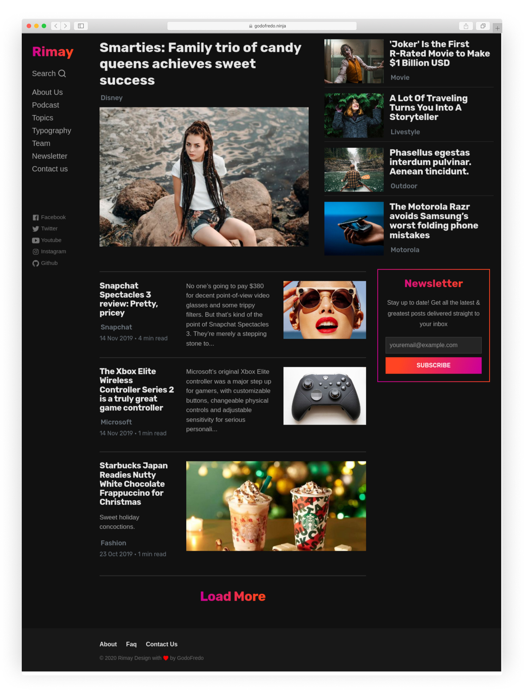

# Rimay free theme for [Ghost](https://github.com/tryghost/ghost/)

[](https://github.com/TryGhost/Ghost)
[](https://www.paypal.me/godofredoninja)
[](https://www.buymeacoffee.com/GodoFredoNinja)

Hello :smile: , I created this theme for ghost especially for you. It is available for free so you can use on your site. If you have any suggestions to improve the theme send me a Tweet [@GodoFredoNinja](https://twitter.com/GodoFredoNinja)

## :monkey_face: I will leave my [PayPal donation link here](https://www.paypal.me/godofredoninja) and slowly move away to work on beautiful themes for Ghost

[](https://www.paypal.me/godofredoninja)

[](https://www.behance.net/gallery/93133463/Rimay)

## Demo

You can see Rimay in action on my Page [Demo](https://godofredo.ninja)

If for some reason I'm using a theme other than Rimay. then you can see the screenshots in [behance](https://www.behance.net/gallery/93133463/Rimay)

## Featured

- Supports English and Spanish language
- [AMP](https://github.com/godofredoninja/Hodor-AMP-Ghost) Template
- Very fast search
- Related Articles (6 articles)
- Social Media
- Page for Tags
- Support Disqus comments
- Buttons to share Post
- YouTube, Vimeo, kickstarter, dailymotion => Responsive
- Lazy load Image for better performance
- Code syntax [Prismjs](http://prismjs.com/index.html#languages-list) Supported all syntax.

## Web Browser Support for rimay

Rimay supports the following web [browsers](http://caniuse.com/#search=flexbox).

### Font Icons

Icons used from [Ionicons](https://ionicons.com) and [Icomoon](https://icomoon.io/app/#/select) generated SVG by [Icomoon](https://icomoon.io/app/#/select) import  `src/selection.json`

## Development

Rimay uses [Gulp](https://gulpjs.com/) as a build tool and [Yarn](https://yarnpkg.com/) to manage front-end packages.

```bash
# clone this repo
$ git clone https://github.com/godofredoninja/rimay.git

# Use branch Dev
$ git checkout dev

# install the dependencies
$ cd rimay && yarn

# run build & livereload task
$ yarn dev

# link to ghost themes dir
$ ln -s $PWD path/to/ghost/content/themes/rimay

# restart ghost server
$ cd path/to/ghost && ghost restart --development
```

### Build commands

- `yarn dev` — Compile assets when file changes are made, start [livereload](http://livereload.com/)
- `yarn build` — Compile and optimize the files in your assets directory
- `yarn release` — Compile assets for production and generate a `zip`

#### Additional commands

- `yarn lint:js` — [Standard](https://standardjs.com/), Check for errors in the script.
- `yarn lint:scss` — [Stylelint](https://stylelint.io/), Check for errors in the styles.
- `yarn lint` — check error in script and styles.
- `yarn scan` — [Ghost Scan](https://github.com/TryGhost/gscan) check for errors, deprecations and other compatibility issues.
- `yarn test` — Check the script errors and styles then check the theme if it is compatible with the latest version of Ghost.

### Credits

- [Hodor AMP](https://github.com/godofredoninja/Hodor-AMP-Ghost)
- [Normalize](https://necolas.github.io/normalize.css/)
- [Ghost Search](https://github.com/HauntedThemes/ghost-search)
- [Prismjs](http://prismjs.com/)
- [Medium Zoom](https://github.com/francoischalifour/medium-zoom)
- [Lazysizes](https://github.com/aFarkas/lazysizes)
- [Fonts](https://fonts.google.com/?query=domine&selection.family=Rubik)
- [Safari Light - Mockup](https://www.uplabs.com/posts/safari-light-version)

## Copyright & License

Copyright (c) 2020 GodoFredo - Released under the [GPLv3 license](LICENSE)
